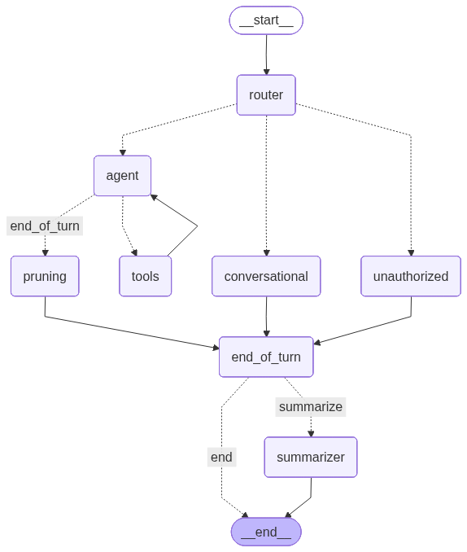

# Medical-Bot

A specialized RAG-based chatbot for answering questions about medications using official Spanish leaflets.

## About The Project

The average patient in Spain spends significant time trying to find specific information, such as contraindications or dosage, within poorly formatted and dense PDF leaflets (`prospectos`). Medical-Bot aims to solve this problem by providing a simple conversational interface to query this information.

**The promise:** "Ask anything about your medication and receive an answer with an exact quote from the official leaflet in few seconds."

This project is built on a knowledge base of common Spanish medications and serves as a case study in building robust, data-driven, and production-ready RAG systems.

## Tech Stack & Pipeline

The core of this project is a Retrieval-Augmented Generation (RAG) pipeline built with Python and LangChain. The pipeline is orchestrated by a single script (`scripts/_03_ingest.py`) and is designed to be **idempotent**: re-running the process for a document automatically cleans up old data and replaces it with the updated version.

### Step 1: LLM-Powered PDF-to-Markdown Conversion

The first stage of the pipeline (`scripts/_01_pdf_to_markdown.py`) treats the PDF as a visual document. It converts each page into an image and sends the full sequence to a multimodal LLM (Google's Gemini), forcing a structured Markdown output for maximum reliability.

### Step 2: Sentence-Window Chunking Strategy

The second stage (`scripts/_02_markdown_to_chunks.py`) implements a state-of-the-art **Sentence-Window Chunking** strategy. This method abandons fixed-size chunks in favor of semantic precision:
1.  The Markdown is parsed into its constituent sentences and list items, treating each as a single, atomic fact.
2.  Each sentence is then embedded along with a "window" of N sentences before and after it.
This provides the embedding model with rich semantic context, allowing the retriever to find the most relevant fact with surgical precision, a method that has proven to dramatically increase retrieval performance in our evaluations.

### Step 3: Embedding and Idempotent Vector Storage

The final ingestion step (`scripts/_03_ingest.py`) is designed for robustness. It first cleans any old data for the source document in Supabase, then generates embeddings for the new chunks using a specialized Google model (`gemini-embedding-001`) and uploads them.

## The Agent Application (`src/graph.py`)

The user-facing application is a sophisticated, stateful agent built with **LangGraph**. This architecture allows for natural, multi-turn conversations and robust, long-term memory.



1.  **Intelligent Intent Router:** At the core of the agent is a `router` node. This component uses a fast and efficient LLM (like `gemini-2.5-flash`) to classify the user's intent with each message (e.g., `pregunta_medicamento`, `pregunta_general`, `saludo_despedida`). It acts as an intelligent "receptionist" that directs the conversation down the appropriate path.

2.  **ReAct Agent Core:** For complex queries (like those about medications), the router passes control to the main `agent` node. This agent uses a more powerful LLM (like `gpt-4o`) and follows the **ReAct (Reasoning and Acting)** pattern. It can reason about the user's query, use tools (via the `tools` node) like a custom retriever to search for information, and formulate answers based on the retrieved context.

3.  **Context-Aware Query Rewriting:** Before searching the database, the agent passes its intended query to a `query_rewriter` node. This component uses an efficient LLM to enrich the simple query with relevant context from the conversation history (e.g., a patient's pre-existing conditions). This creates a more detailed, semantically-rich question, drastically improving the accuracy of the documents retrieved by the RAG pipeline.

4.  **Robust Conversational Memory:** The agent is designed for long conversations using a powerful memory system managed by a dedicated `end_of_turn` node that acts as a "pacemaker":
    *   **Short-Term Memory (Sliding Window):** The agent always has access to the last few turns of the conversation, ensuring it remembers the immediate context.
    *   **Long-Term Memory (Summarization):** The `end_of_turn` node keeps track of the conversation turns. Every three turns, it routes the flow to a `summarizer` node. This node uses an efficient LLM to condense the recent conversation into an updated summary. Crucially, once summarized, the short-term memory is completely cleared to prevent redundant information processing.
    *   **Immediate Pruning for Efficiency:** After the agent uses a tool, a dedicated `pruning` node immediately removes the large, raw tool outputs from the short-term memory. This keeps the conversational history clean, radically reduces token usage, and ensures that only high-level conclusions are passed to the long-term memory and future agent turns.

### Detailed Graph Architecture

The agent's logic is orchestrated by a state graph where each node represents a specific capability. This modular design allows for clear, maintainable, and robust conversational flows.

| Node | Responsibility | Logic / Example of Functioning |
| :--- | :--- | :--- |
| `router` | **Classify & Protect.** | Analyzes user input. Is it a greeting, a query about a known medicine, or an unknown one? Acts as the first line of defense. |
| `agent` | **Reason & Plan.** | The core ReAct brain. Guided by its System Prompt, it plans the steps and tools needed to answer a user's question. |
| `query_rewriter` | **Optimize Search.** | Enriches the agent's query with conversational context (e.g., patient conditions) to make the database search maximally relevant. |
| `tools` | **Act & Retrieve.** | Executes actions planned by the agent—primarily, searching for information in the Supabase vector database. |
| `handle_retrieval_failure`| **Manage Retrieval Failures.** | If `tools` finds no documents, this node provides a safe, predefined response, preventing the agent from hallucinating. |
| `unauthorized` | **Block Out-of-Scope Questions.** | If the `router` detects a medication not in our database, this node informs the user, acting as a critical guardrail. |
| `pruning` & `summarizer`| **Manage Memory.** | These nodes maintain long-term memory, pruning raw tool outputs and summarizing turns to keep the context efficient and focused. |

#### Handling Complex Queries

The agent's true power is revealed when faced with multi-step questions (e.g., "Compare Nolotil and Ibuprofen"). It leverages the ReAct pattern to solve them iteratively:

1.  The **agent** decides to tackle one medicine first and calls the `tools` node for "Nolotil".
2.  The information returns to the **agent**. It recognizes its task is incomplete.
3.  It calls the `tools` node again, this time for "Ibuprofen".
4.  With information for both medicines in its context, the **agent** synthesizes a final, comprehensive answer.

This `Agent -> Tool -> Agent` loop is what enables the chatbot to break down and solve complex problems.

## Advanced Features: Observability & Safety

To move from a functional prototype to a reliable application, this project incorporates crucial features for monitoring and safety.

### Observability with LangSmith

The entire agentic graph is integrated with [LangSmith](https://smith.langchain.com/) for end-to-end observability. Full tracing allows for detailed debugging of the agent's reasoning, tool usage, and state changes at every step of the graph.

### Multi-Layered Guardrails

Given the sensitive nature of medical information, the chatbot implements several distinct layers of safety checks to ensure robust and predictable behavior.

1.  **Router Guardrail (Known vs. Unknown Medicine):** The initial `router` node validates medication names against a known list. If a user asks about an unknown medication, the flow is diverted to a specific `unauthorized` node, preventing any attempt to answer.
2.  **Retrieval Failure Guardrail (No Documents Found):** If a search for a *known* medication yields no relevant documents (for a very specific query), the graph diverts the flow to a `handle_retrieval_failure` node. This provides a safe, canned response instead of letting the agent guess or hallucinate an answer.
3.  **Prompt-Level Guardrail (Behavioral Constraints):** The main agent is governed by a robust `System Prompt`. This foundational instruction strictly forbids providing medical advice and mandates that its answers be based *exclusively* on the retrieved information.
4.  **Retrieval-Level Guardrail (Metadata Filtering):** *[Future implementation]* To prevent context contamination, the retrieval pipeline will be enhanced with metadata filtering. When the agent identifies the relevant medication(s), it will force the vector search to consider **only** the chunks belonging to those leaflets.

## Robust Evaluation Framework

To guide development and ensure high quality, this project uses a comprehensive, two-layer evaluation framework based on a manually curated "golden dataset" of questions.

### 1. Retriever Evaluation

We measure the performance of our document retrieval system *before* the LLM sees the data. Using our golden dataset, a dedicated script (`evaluation/evaluate_retriever.py`) calculates key metrics:
*   **Recall@k:** Measures the retriever's ability to find all relevant documents.
*   **Precision@k:** Measures how much "noise" or irrelevant information is retrieved.
*   **F1-Score & MRR:** Provide a holistic view of the retriever's overall performance and ranking quality.

### 2. Generation Evaluation

We evaluate the quality of the final, user-facing answer using the **RAGAS** library, which employs an "LLM-as-a-Judge" approach.
*   **Faithfulness:** Measures the degree of hallucination by checking if the answer is strictly based on the provided context.
*   **Answer Relevancy:** Assesses if the answer directly addresses the user's question.

## Experimental Research & Data-Driven Decisions

To continuously improve the system, we follow a rigorous process of experimentation. New techniques are tested in isolation and evaluated against our baseline metrics. This data-driven approach ensures that only features with a clear positive impact are integrated.

### Experiment: Query Rewriting for Improved Retrieval
To enhance retrieval performance for complex, conversational queries, we implemented and evaluated a "Query Rewriting" step.
*   **Hypothesis:** Rephrasing conversational user questions into detailed, self-contained queries before sending them to the vector database would improve retrieval scores, especially in multi-turn dialogues.
*   **Implementation:** We added a `query_rewriter_node` to the agent graph. This node uses an efficient LLM (`gemini-2.5-flash`) to take the agent's simple query and enrich it with relevant context from the conversation history.
*   **Results:** Qualitative analysis in LangSmith showed a significant improvement in the relevance of retrieved documents. The enriched queries (e.g., transforming "Is it safe for me?" into "Is Lexatin safe for a 29-year-old male with diabetes and anxiety?") led to more precise context being passed to the final generation step.
*   **Decision:** Despite a minor increase in latency, the dramatic improvement in retrieval quality and answer accuracy makes query rewriting a critical component of the agent's architecture. The feature has been permanently integrated into the production graph.

### Experiment: Hybrid Search with Pinecone
To test the hypothesis that hybrid search could improve retrieval for domain-specific terms, a migration from Supabase/pgvector to Pinecone was undertaken.
*   **Hypothesis:** A hybrid approach combining semantic (dense) and keyword (sparse) search would outperform a purely semantic system, especially for technical queries involving specific medication names or chemical compounds.
*   **Implementation:**
    1.  The vector database was migrated to Pinecone to leverage its native support for sparse-dense vectors.
    2.  An advanced retrieval pipeline was built using Pinecone's recommended two-index approach (one for dense vectors, one for sparse) and a custom Reciprocal Rank Fusion (RRF) layer to merge results with a controllable `alpha` weight.
*   **Results:**
    *   The purely semantic search on Pinecone (`alpha = 1.0`) performed on-par with the original Supabase baseline, confirming its effectiveness.
    *   However, any introduction of keyword-based search (`alpha < 1.0`) consistently **degraded performance** across all key metrics (F1-Score, MRR, Precision, Recall) for the existing `golden_dataset`.
*   **Decision:** For the current, predominantly conceptual question set, the added complexity of a hybrid search system did not provide a net benefit and introduced a risk of performance degradation. The experiment was documented, and the project reverted to the simpler, more robust, and equally performant Supabase/pgvector architecture.

### Experiment: Optimizing Embeddings and Re-Ranking
A foundational experiment was conducted to find the optimal embedding and ranking architecture.
*   **Hypothesis:** Migrating from OpenAI's embeddings to a newer, specialized model (Google's `gemini-embedding-001`) and adding a re-ranking layer (Cohere Rerank) would yield significant improvements.
*   **Implementation:**
    1.  The entire data pipeline was migrated to use `gemini-embedding-001`, including optimizations like specifying `task_type` for queries (`retrieval_query`) and documents (`retrieval_document`).
    2.  A controlled A/B test was performed using the evaluation framework's re-ranking capability.
*   **Results:**
    *   **Google Embeddings Baseline:** The migration to `gemini-embedding-001` alone caused a **dramatic performance increase**, with the **F1-Score jumping from 39.65% to 47.87% (+8.2 points)**. This established a new, powerful baseline.
    *   **Re-Ranking Impact:** When the Cohere re-ranker was applied on top of this strong baseline, performance metrics consistently **decreased** (F1-Score dropped to 46.20%), revealing a "performance ceiling".
*   **Decision:** The optimal retrieval architecture was determined to be **`gemini-embedding-001` used standalone**. The re-ranker was disabled from the production configuration, proving that for this use case, a simpler, faster, and cheaper architecture is also the most accurate.

### Experiment: Sentence-Window Chunking for Precision Boost
With the embedding model optimized, a final experiment targeted the chunking strategy itself.
*   **Hypothesis:** Migrating from chunking by semantic blocks to a more granular "Sentence-Window" approach would improve retrieval precision by creating more focused, atomic chunks.
*   **Implementation:** The chunking logic was re-implemented to treat each sentence (and list item) as a distinct unit. Each unit is embedded along with a "window" of surrounding sentences to preserve semantic context.
*   **Results:** The experiment was a resounding success. An A/B test showed a massive **+17.63 point increase in Precision@5** (from 40.12% to 57.75%) and a **+8.04 point increase in F1-Score**. This confirmed that the new strategy provides a much more accurate context to the final model.
*   **Decision:** **Sentence-Window Chunking** has been adopted as the new production standard for the ingestion pipeline due to its demonstrated superiority in retrieval precision.

### Experiment: PDF Parser Optimization with Docling
To address the primary bottleneck of the ingestion pipeline—the slow, image-based parsing of PDFs—we explored a faster, programmatic alternative recommended for production environments: Docling.
*   **Hypothesis:** Replacing the multimodal Gemini model with Docling for the initial PDF-to-Markdown conversion would dramatically reduce processing time without a critical loss in data quality.
*   **Implementation:**
    1.  A standalone pipeline was built using the `docling` library to convert PDFs directly into Markdown (`_exp_01_docling_parser_hybrid.py`).
    2.  A qualitative analysis revealed a significant drawback: Docling produced a "flat" document structure, losing the critical hierarchical nesting (e.g., sub-sections within sections) that the visual Gemini model inferred correctly.
    3.  A **hybrid approach** was then developed, using Docling for the fast initial extraction and a secondary, text-only call to Gemini to intelligently re-introduce the lost hierarchy.
*   **Results:**
    *   **Gemini-Visual (Baseline):** ~140 seconds per document. Highest structural quality.
    *   **Docling-Only:** ~38 seconds. Very fast, but poor structural quality.
    *   **Hybrid (Docling + Gemini-Text):** ~90 seconds. A significant speed-up (~35%) while recovering most of the structural quality.
*   **Decision:** For this project, where the primary goal is to build the highest-quality RAG system for learning and evaluation purposes, we decided to **retain the original Gemini-visual pipeline in production**. Although slower, it provides the "gold standard" of data structure, which is fundamental to our current objectives. The successful hybrid experiment is documented as a viable, high-performance alternative for a production scenario where speed and cost would be more critical constraints.

### Experiment: Advanced Citation with ContextCite
As part of ongoing research to improve the reliability of the chatbot, we have experimented with advanced citation techniques. Specifically, we explored the `ContextCite` library, which provides a more rigorous form of "contributive attribution".
*   **Our Current Method:** The LLM self-reports which documents it used ("corroborative attribution").
*   **ContextCite's Method:** Uses a scientific approach of ablating (removing) parts of the context to mathematically determine which specific sentences **caused** the model to generate its response ("contributive attribution").
While computationally intensive, this method provides a much more granular and honest view of the model's reasoning process. An experimental script for visual comparison can be found in `evaluation/compare_citations.py`.

## How to Use

### Ingestion Pipeline
To process a new medication leaflet, place the PDF file in the `/data` directory and run the main ingestion script from the root of the `medical-bot` folder:
```bash
python scripts/_03_ingest.py nombre_del_medicamento.pdf
```

### Chatbot Application
To interact with the agent, run the main graph script:
```bash
python -m src.graph
```

